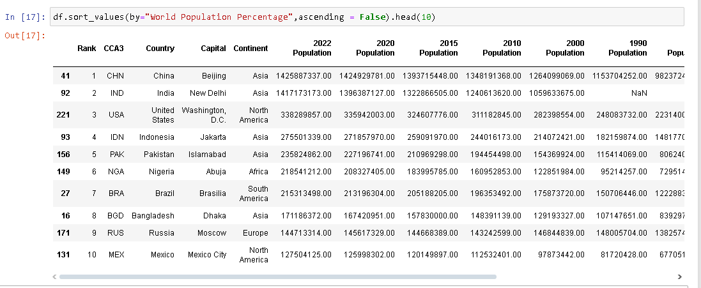
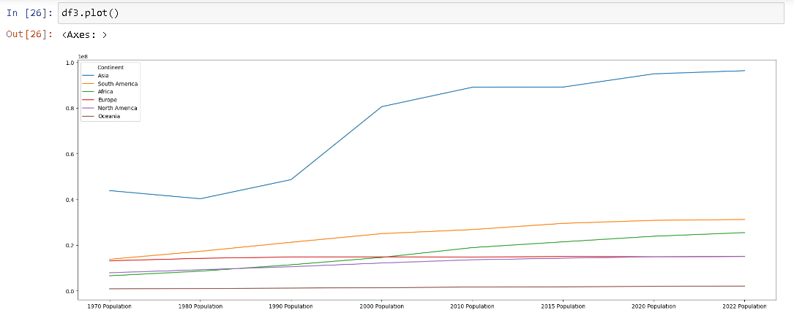
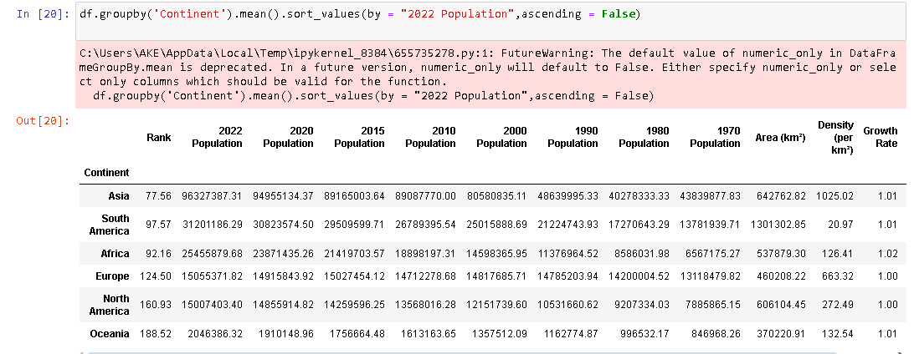
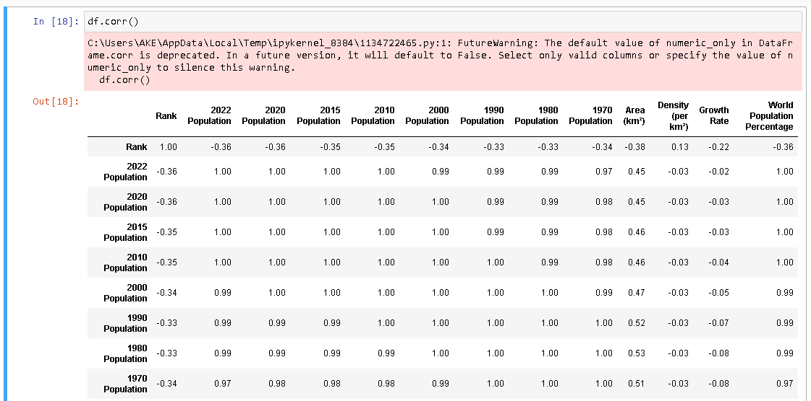
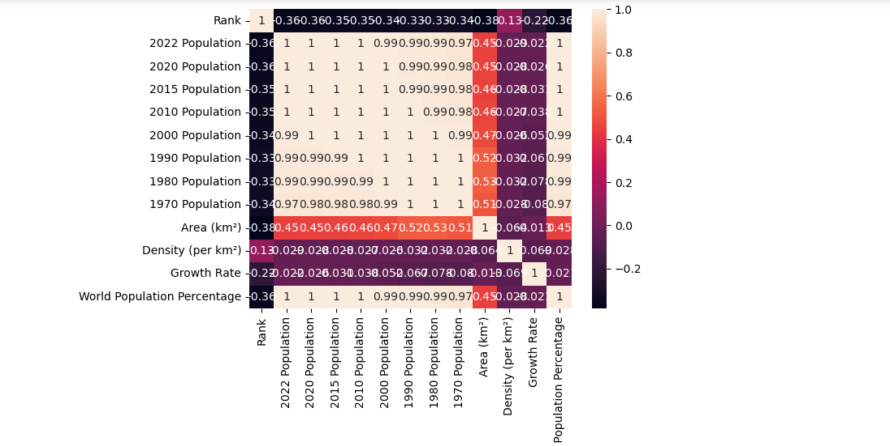

# EDA_World_Population
Exploratory Data Analysis is the intial phase of data analysis where patterns, relationships, and outliers in the dataset are identified.

## Key Steps
- import libraries
  * Pandas - for data manipulation
  * Seaborn For Statistical data visualization
  * Matplotlib For plotting graph
- Loading data
  use `pd.read.csv()`

  

- Data cleaning

- Data visualization

  
  
- Grouping data
  * group data by categories to analyze trends

-  Correlation Analysis
   * to find correlations between numeric columns which helps in understanding relationships

